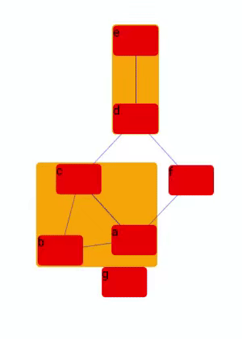

# react-cola
[WebCola](https://github.com/tgdwyer/WebCola) for React.

<p align="center">
  
</p>

## 🚀 Getting Started

Using [`npm`]():

```bash
npm install --save react-cola
```

Using [`yarn`]():

```bash
yarn add react-cola
```

## ✍️ Example

Below is a basic example of how to define a simple `renderLayout` prop, which will be called whenever the layout has been updated by WebCola.

```javascript
import React from 'react';
import WebCola from 'react-cola';
import { Line } from 'react-lineto';

export default () => (
  <WebCola
    renderLayout={layout => (
      <>
        {layout.groups().map(
          ({ bounds: { x, X, y, Y } }, i) => {
            const width = X - x;
            const height = Y - y;
            return (
              <div
                key={i}
                style={{
                  position: 'absolute',
                  left: x,
                  top: y,
                  width,
                  height,
                  backgroundColor: 'orange',
                  borderRadius: 5,
                  zIndex: -2,
                }}
              />
            );
          },
        )}
        {layout.links().map(
          ({ source, target }, i) => {
            const { x, y } = source;
            const { x: x2, y: y2 } = target;
            return (
              <Line
                key={i}
                x0={x}
                y0={y}
                x1={x2}
                y1={y2}
                borderColor="blue"
                zIndex={-1}
              />
            );
          },
        )}
        {layout.nodes().map(
          ({x, y, width, height, name }, i) => (
            <div
              key={i}
              style={{
                position: 'absolute',
                left: x - width * 0.5,
                top: y - height * 0.5,
                width,
                height,
                backgroundColor: 'red',
                borderRadius: 5,
              }}
            >
              {name}
            </div>
          ),
        )}
      </>
    )}
    nodes={[
      {
        width: 60,
        height: 40,
        name: 'a',
      },
      {
        width: 60,
        height: 40,
        name: 'b',
      },
      {
        width: 60,
        height: 40,
        name: 'c',
      },
      {
        width: 60,
        height: 40,
        name: 'd',
      },
      {
        width: 60,
        height: 40,
        name: 'e',
      },
      {
        width: 60,
        height: 40,
        name: 'f',
      },
      {
        width: 60,
        height: 40,
        name: 'g',
      },
    ]}
    links={[
      { source: 1, target: 2 },
      { source: 2, target: 3 },
      { source: 3, target: 4 },
      { source: 0, target: 1 },
      { source: 2, target: 0 },
      { source: 3, target: 5 },
      { source: 0, target: 5 },
    ]}
    groups={[
      { leaves: [0], groups: [1] },
      { leaves: [1, 2] },
      { leaves: [3, 4] },
    ]}
    width={540}
    height={760}
  />
);
```

## Thanks to
[@tgdwyer](https://github.com/tgdwyer)
[@fzembow](https://github.com/fzembow)

## ✌️ License
[MIT](https://opensource.org/licenses/MIT)
